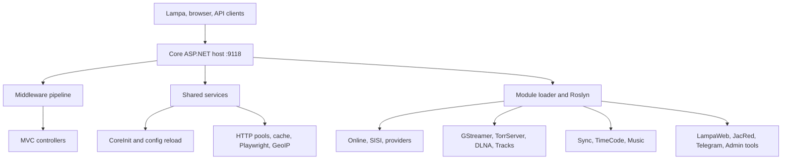

Lampac NextGen построен на ASP.NET Core (.NET 10) и состоит из строго разделенных слоев: хост-приложение **Core**, общая библиотека **Shared**, ядра контента **Online** и **SISI**, а также динамически загружаемых модулей. Решение содержит более 128 проектов и поддерживает горячую перезагрузку конфигурации, компиляцию пользовательских модулей через Roslyn и гибкую цепочку middleware.

На этой странице вы найдете архитектурную диаграмму, описание каждого слоя и структуру ключевых каталогов проекта.

<Frame>
  
</Frame>

## Архитектурная схема



## Слои приложения

| Слой | Описание |
| --- | --- |
| **Core** | Точка входа, Middleware Pipeline, `ApiController`. Запускает хост ASP.NET Core, настраивает DI, загружает и компилирует модули, формирует цепочку middleware. |
| **Shared** | Общая библиотека: модели, контроллеры, конфигурация (`CoreInit`), HTTP-пулы, кеш, Playwright, Roslyn (`CSharpEval`), GeoIP и сервисы. |
| **Online** | VOD-ядро: плагин `/online.js`, агрегатор `/lite/*`, провайдеры в `Modules/Online*/`. Обрабатывает поиск и выдачу ссылок на фильмы и сериалы. |
| **SISI** | 18+-ядро: плагин `/sisi.js`, SQLite (история, закладки). Платформы в `Modules/Adult/`. |
| **Modules/** | Функциональные модули: прокси, транскодинг, синхронизация, Telegram-боты, админ-панель, TorrServer, DLNA и другие. |

## Структура проекта

Решение `NextGen.slnx` объединяет более 128 проектов. Ключевые каталоги:

```text
lampac/
├── Core/                       # Точка входа, middleware, загрузка модулей
│   ├── Program.cs              # Запуск, инициализация
│   ├── Startup.cs              # DI, HTTP-клиенты, загрузка модулей
│   ├── Controllers/            # ApiController, RchApiEndpoints
│   ├── Middlewares/            # WAF, Accsdb, BaseMod, ProxyImg и другие
│   ├── Services/               # NativeWebSocket, CronCacheWatcher
│   ├── data/                   # GeoIP базы, статические JSON-базы
│   ├── plugins/                # JS-плагины (RCH, NWS)
│   └── wwwroot/                # Статика (SISI UI, stats и др.)
├── Shared/                     # Общая библиотека
│   ├── CoreInit.cs             # Загрузка и hot-reload конфигурации
│   ├── BaseController.cs       # Базовый контроллер
│   ├── Models/                 # Общие модели данных
│   └── Services/               # HTTP, кеш, Playwright, GeoIP, Roslyn
├── Online/                     # VOD-ядро (/online.js, /lite/*, externalids)
├── SISI/                       # 18+-ядро (/sisi.js, SQLite, закладки)
├── Modules/
│   ├── AdminPanel/             # Веб-админка (manifest: enable: false)
│   ├── Adult/                  # Платформы 18+ (15 источников)
│   ├── Catalog/                # Каталог сайтов (YAML)
│   ├── Community/              # TelegramAuth, TelegramAuthBot
│   ├── DLNA/                   # DLNA/UPnP медиасервер
│   ├── ForkPlayerXML/          # ForkPlayer: /fxml
│   ├── GStreamer/              # HLS/fMP4 транскодинг (/gst/*)
│   ├── ExternalBind/           # Привязка URL (manifest: enable: false)
│   ├── MsxNative/              # MSX-плеер, Sisi
│   ├── JacRed/                 # Агрегатор торрент-индексаторов
│   ├── Kit/                    # Криптография
│   ├── LampacApk/              # Генератор Android APK
│   ├── LampaWeb/               # Хостинг Lampa UI
│   ├── NextHUB/                # 18+ витрина на YAML
│   ├── OnlineAnime/            # 14 аниме-источников
│   ├── OnlineENG/              # 10 англоязычных источников
│   ├── OnlineGEO/              # 3 грузинских источника
│   ├── OnlinePaid/             # 9 платных VOD-источников
│   ├── OnlineRUS/              # 24 российских CDN
│   ├── OnlineUKR/              # 8 украинских источников
│   ├── PidTor/                 # PidTor источник
│   ├── Proxy/                  # CubProxy, TmdbProxy, CacheMedia и др.
│   ├── Sync/                   # Sync, SyncEvents, Storage, TimeCode
│   ├── TorrServer/             # Управление TorrServer
│   ├── Tg-notify.bot/          # Telegram-уведомления о сериях/озвучках
│   ├── Tracks/                 # Субтитры и дорожки (FFprobe)
│   ├── Transcoding/            # FFmpeg транскодинг
│   ├── WatchTogether/          # Синхронный просмотр
│   └── WebLog/                 # Отладочный лог HTTP/Playwright
├── TestModules/                # Примеры модулей → mods/ при publish
├── config/
│   ├── base.conf               # Дефолтные значения
│   ├── example.init.conf       # Пример конфига (JSON)
│   └── example.init.yaml       # Пример конфига (YAML)
├── docker-compose.yaml         # Production (порт 9118)
├── docker-compose.dev.yaml     # Dev (порт 29118)
├── charts/lampac/              # Helm-чарт для Kubernetes
├── Dockerfile                  # Multi-arch образ (amd64, arm64)
├── build.sh                    # Сборка в publish/
├── install.sh                  # Нативная установка Linux
└── NextGen.slnx                # Solution (128+ проектов)
```

После `dotnet publish` исходники модулей копируются в `module/` (Online, SISI, Modules), а TestModules — в `mods/`. DLL-зависимости размещаются в `runtimes/references/`.

<Note>
  Решение содержит более 128 проектов, включая отдельный проект на каждого провайдера контента в группах `OnlineRUS`, `OnlinePaid`, `OnlineAnime`, `OnlineENG`, `OnlineUKR` и `OnlineGEO`.
</Note>

## Дополнительные разделы

<Columns cols={2}>
  <Card title="Модули Online" href="/modules/online">
    VOD-ядро, провайдеры и агрегатор /lite/\*
  </Card>

  <Card title="Модули SISI" href="/modules/sisi">
    18+-ядро и платформы Adult
  </Card>

  <Card title="NextHUB" href="/modules/nexthub">
    YAML-витрина 18+
  </Card>

  <Card title="Система модулей" href="/architecture/modules">
    Загрузка модулей, Roslyn, manifest.json и фильтры
  </Card>

  <Card title="Middleware Pipeline" href="/architecture/middleware">
    Цепочка middleware от ForwardedHeaders до контроллеров
  </Card>
</Columns>
